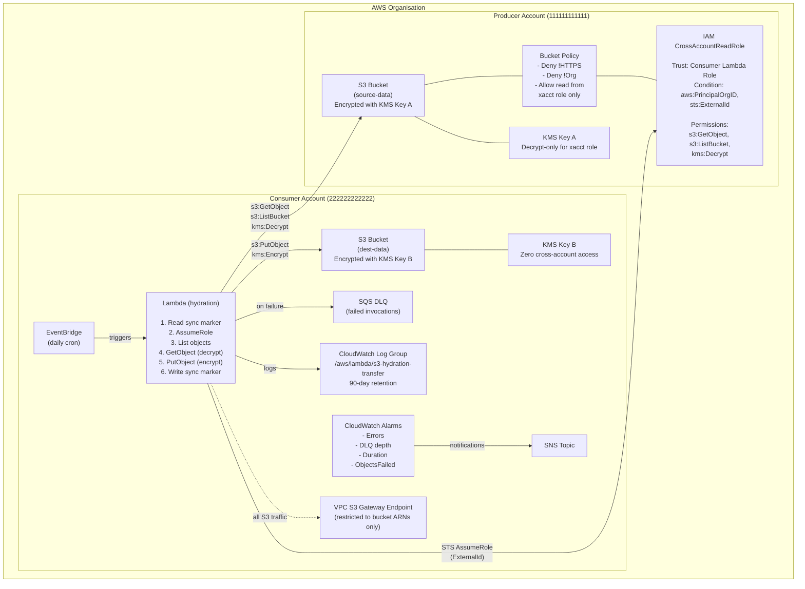

# S3 Hydration -- Architecture

## Overview

S3 Hydration provides cross-account S3 data transfer within an AWS Organisation using the **Consumer Pull** model. The solution handles low-volume, daily scheduled batch transfers and is deployed as AWS Service Catalog products with customer-managed KMS keys for encryption at rest.

The producer account exposes a read-only IAM role. The consumer account owns a Lambda function that assumes that role, streams objects from the producer bucket, and re-encrypts them into the consumer bucket using the consumer's own KMS key. This keeps the data flow strictly one-directional: the producer never writes to the consumer, and the consumer never writes to the producer.

Each side of the integration (producer and consumer) is packaged as a separate Service Catalog product backed by CloudFormation, allowing teams to self-service deploy with guardrails enforced by the catalog constraints.

---

## Options Analysis

| Criteria | Option A: Consumer Pull | Option B: Producer Push | Option C: S3 Replication | Option D: S3 Batch Operations |
|---|---|---|---|---|
| **Score** | **38 / 40 -- SELECTED** | 24 / 40 | 23 / 40 | 21 / 40 |
| Model | Consumer Lambda assumes a read-only role in the producer account, streams objects, and re-encrypts into the consumer bucket. | Producer account is granted write access to the consumer bucket and pushes objects directly. | Native S3 replication from producer to consumer using a replication configuration. | AWS S3 Batch Operations job copies objects cross-account on a schedule. |
| Data flow direction | One-way: consumer pulls. Producer has no knowledge of or access to the consumer bucket. | Bidirectional trust: producer needs write access to consumer bucket, violating the one-way flow principle. | Producer replication role requires write access to the consumer bucket and consumer KMS key. | Requires cross-account permissions in both directions for job orchestration. |
| KMS compatibility | Clean separation. Producer key grants Decrypt to the cross-account role. Consumer key is never shared. | Consumer KMS key must grant Encrypt to the producer role, expanding the key policy blast radius. | Cross-account KMS for replication is fragile. The producer replication role needs both Decrypt on source and Encrypt on destination keys. | Same KMS cross-account complexity as replication, plus Batch Operations service role adds another principal. |
| Service Catalog fit | Excellent. Two independent CloudFormation stacks, one per account. No circular dependencies. | Moderate. Producer stack must reference consumer bucket ARN and KMS key ARN at deploy time, creating ordering dependencies. | Poor. Replication configuration is tightly coupled to the destination bucket and KMS key. Changes on either side can break replication silently. | Poor. S3 Batch Operations is not a native CloudFormation resource. Requires custom resources or external orchestration. |
| Operational overhead | Low. Single Lambda function with CloudWatch alarms, DLQ, and marker-based incremental sync. | Medium. Producer-side retry logic, monitoring, and permissions management. | Medium. Replication metrics are limited. Failures surface as replication lag with no built-in DLQ. | High. Job creation, manifest generation, IAM role management, and completion polling. Over-engineered for low-volume daily batches. |
| Security posture | Strongest. Producer exposes absolute minimum: read-only S3 and Decrypt-only KMS. | Weakest. Producer has write access to consumer storage, enabling data injection or overwrite. | Moderate. Producer replication role has broad write access to consumer bucket. | Moderate. Batch Operations service role requires broad permissions. |

---

## Architecture Diagram

---

## Data Flow

The transfer follows a strict sequence on each scheduled invocation:

1. **EventBridge triggers Lambda on schedule.** A daily cron rule (e.g. `cron(0 2 * * ? *)`) invokes the hydration Lambda function. The schedule is configurable via the Service Catalog product parameters.

2. **Lambda reads the sync marker from the consumer bucket.** The function reads a marker object (e.g. `_sync/last_successful_sync.json`) from the consumer bucket. This marker contains the timestamp of the last successful sync. On first run, or if the marker is absent, a full sync is performed.

3. **Lambda assumes the cross-account role via STS with ExternalId.** The function calls `sts:AssumeRole` targeting the `CrossAccountReadRole` in the producer account. The request includes the `ExternalId` parameter to prevent confused-deputy attacks. The returned temporary credentials are scoped to read-only S3 and KMS Decrypt permissions.

4. **Lambda lists objects in the producer bucket filtered by last sync time.** Using the assumed-role credentials, the function calls `s3:ListObjectsV2` on the producer bucket. Objects are filtered by `LastModified` against the sync marker timestamp to achieve incremental transfer.

5. **For each object, Lambda performs an idempotent copy.**
   - **HEAD check:** The function issues a `HeadObject` call against the consumer bucket to check whether the object already exists with a matching ETag or metadata. If it does, the object is skipped. This provides idempotency across retries.
   - **GetObject:** The function calls `s3:GetObject` on the producer bucket using the assumed-role credentials. The S3 service decrypts the object transparently using KMS Key A (the cross-account role has `kms:Decrypt` permission on that key).
   - **PutObject:** The function streams the object body directly into the consumer bucket via `s3:PutObject`, specifying server-side encryption with KMS Key B (the consumer's own key). The object is re-encrypted at rest under the consumer's key without ever being written to local disk.

6. **Lambda writes the sync marker on success.** After all objects are processed (or all failures are recorded), the function writes an updated marker object to the consumer bucket with the current timestamp. This ensures the next invocation picks up only new or modified objects.

7. **Failures are isolated per-object; failed invocations go to SQS DLQ.** Individual object transfer failures are caught, logged to CloudWatch, and do not abort the batch. The sync marker is still updated to reflect progress. If the Lambda invocation itself fails (timeout, out-of-memory, unhandled exception), the asynchronous invocation configuration routes the failed event to an SQS dead-letter queue for investigation and replay.

---

## Defence in Depth -- 7 Security Layers

The solution implements seven distinct security layers. No single layer is relied upon in isolation; each provides an independent control that limits blast radius if another layer is bypassed or misconfigured.

### Layer 1: IAM Role Trust Policy

The `CrossAccountReadRole` in the producer account has a trust policy with three conditions:

- **Principal:** Only the specific Lambda execution role ARN from the consumer account can assume the role. No wildcards.
- **aws:PrincipalOrgID:** The assuming principal must belong to the same AWS Organisation. This prevents any principal outside the organisation from assuming the role, even if the ARN were known.
- **sts:ExternalId:** A shared secret (the ExternalId) must be provided in the `AssumeRole` call. This mitigates confused-deputy attacks where an intermediary service might be tricked into assuming the role on behalf of an unauthorised party.

### Layer 2: IAM Permissions Policy

The permissions policy attached to the `CrossAccountReadRole` grants the absolute minimum:

- `s3:GetObject` on the producer bucket (specific prefix if applicable).
- `s3:ListBucket` on the producer bucket.
- `kms:Decrypt` on the producer KMS key.

No write, delete, or administrative permissions are granted. The consumer Lambda execution role similarly has least-privilege permissions scoped to its own bucket and KMS key.

### Layer 3: S3 Bucket Policy

The producer bucket policy enforces:

- **Deny non-HTTPS:** All requests over plain HTTP are denied via a `Condition: aws:SecureTransport = false` deny statement.
- **Deny outside Organisation:** Requests from principals outside the AWS Organisation are denied via `aws:PrincipalOrgID`.
- **Allow only the cross-account role:** An explicit allow statement grants `s3:GetObject` and `s3:ListBucket` only to the `CrossAccountReadRole` ARN.

### Layer 4: KMS Key Policy

- **Producer KMS Key (Key A):** The key policy grants `kms:Decrypt` only to the `CrossAccountReadRole`. No `kms:Encrypt`, `kms:GenerateDataKey`, or administrative actions are granted cross-account. The producer retains full administrative control.
- **Consumer KMS Key (Key B):** Zero cross-account access. The key policy grants usage only to principals within the consumer account. The producer account has no visibility into or access to Key B.

### Layer 5: VPC Endpoint Policy

The consumer Lambda function runs inside a VPC with no internet access. All S3 traffic routes through an S3 Gateway VPC Endpoint. The endpoint policy restricts access to exactly two bucket ARNs:

- The producer bucket (for `GetObject` and `ListBucket`).
- The consumer bucket (for `PutObject`, `HeadObject`, and marker operations).

Any attempt by the Lambda function (or anything else in the VPC) to access any other S3 bucket is denied at the network level.

### Layer 6: S3 Hardening

Both producer and consumer buckets are hardened with:

- **Versioning enabled:** Protects against accidental or malicious overwrites and deletions.
- **PublicAccessBlock:** All four public access block settings are enabled (`BlockPublicAcls`, `IgnorePublicAcls`, `BlockPublicPolicy`, `RestrictPublicBuckets`).
- **Server-side access logging:** Access logs are written to a dedicated logging bucket for audit and forensic analysis.

### Layer 7: Monitoring and Alerting

- **CloudWatch Alarms:** Alarms fire on Lambda errors, elevated duration (indicating performance degradation), and SQS DLQ depth (indicating failed invocations requiring attention).
- **CloudTrail:** All S3 data events and KMS usage events are logged in both accounts. Cross-account `AssumeRole` calls are logged in both the producer and consumer CloudTrail trails.
- **SQS Dead Letter Queue:** Failed asynchronous Lambda invocations are preserved in the DLQ with the original event payload, enabling investigation and replay without data loss.

---

## Threat Model

| Threat | Mitigation | Residual Risk |
|---|---|---|
| **Compromised producer account** | The producer account has no credentials for or access to the consumer account. A compromised producer can only read or modify its own data. The consumer pulls data; the producer never pushes. | If an attacker modifies producer data before the next sync, the consumer will ingest the modified data. Mitigated by versioning and out-of-band integrity checks if required. |
| **Compromised consumer credentials** | The assumed-role credentials are temporary (default 1-hour expiry) and scoped to read-only on the producer bucket. On the consumer side, the Lambda role can write only to its own bucket. An attacker with these credentials cannot modify, delete, or exfiltrate data beyond what is already in the two buckets. | An attacker could read all objects in the producer bucket within the scope of the `ListBucket` and `GetObject` permissions. Prefix-scoped permissions can further limit this. |
| **Confused deputy** | The `sts:ExternalId` condition on the trust policy ensures that only callers who know the shared secret can assume the role. Even if an attacker tricks another service into calling `AssumeRole`, the call will fail without the correct ExternalId. | ExternalId is not a secret in the cryptographic sense. It should be treated as a configuration value and rotated periodically. |
| **Data exfiltration via Lambda** | The Lambda runs in a VPC with no internet gateway. The S3 Gateway VPC Endpoint policy restricts traffic to exactly the two bucket ARNs. Even if the Lambda code is compromised, it cannot send data to an external S3 bucket or any internet endpoint. | If an attacker gains control of the Lambda code and modifies the VPC or endpoint configuration, they could potentially open an exfiltration path. This is mitigated by Service Catalog constraints, SCPs, and CloudTrail monitoring. |
| **Man-in-the-middle** | HTTPS is enforced at the bucket policy level via `aws:SecureTransport`. All S3 API calls use TLS. KMS API calls are always TLS. There is no plaintext data path. | Standard TLS trust model applies. AWS manages the certificate infrastructure. |
| **Privilege escalation** | The cross-account role has no IAM, STS, or KMS administrative permissions. It cannot create new roles, modify policies, or grant itself additional access. | If the consumer account itself is compromised at the administrative level, the attacker could modify the Lambda role to request broader permissions. This is mitigated by SCPs and organisational guardrails. |

---

## Key Design Decisions

| Decision | Alternatives Considered | Rationale |
|---|---|---|
| **Consumer Pull over Producer Push** | Producer Push, S3 Replication, S3 Batch Operations | Consumer Pull provides the strongest security posture. The producer exposes only read access. There is no write path from producer to consumer, eliminating an entire class of data injection and overwrite attacks. See Options Analysis above. |
| **Stream via Lambda (GetObject/PutObject) over copy_object** | `s3:copy_object` with cross-account source | `copy_object` requires the destination account to have both read access to the source and a way to specify the source encryption context. Streaming via Lambda gives explicit control over decryption and re-encryption, avoids KMS grant complexity, and allows per-object error handling and transformation. |
| **ExternalId on AssumeRole** | No ExternalId, resource policy conditions only | ExternalId is an industry-standard confused-deputy mitigation recommended by AWS. The cost is one additional parameter in the Service Catalog product; the benefit is defence against a well-documented attack vector. |
| **VPC-bound Lambda** | Lambda with public internet access | Running the Lambda in a VPC with an S3 Gateway Endpoint eliminates internet egress entirely. Combined with the endpoint policy restricting to specific bucket ARNs, this provides network-level data exfiltration prevention that IAM alone cannot offer. |
| **Marker-based incremental sync** | S3 Inventory, S3 Event Notifications, full sync each run | A sync marker (timestamp of last successful run) stored as an S3 object is simple, stateless from the Lambda's perspective, and does not require additional AWS services. S3 Inventory is overkill for low-volume daily batches. S3 Event Notifications would require cross-account EventBridge or SNS, adding complexity. Full sync wastes time and API calls. |
| **Separate CloudFormation stacks per account** | Single stack with cross-account resources, StackSets | Two independent stacks (one producer, one consumer) have no circular dependencies and can be deployed, updated, and torn down independently. Each stack is owned by the respective account team. StackSets were considered but add operational complexity for a two-account pattern. |
| **Lambda over ECS or Step Functions** | ECS Fargate task, Step Functions with S3 Copy state | For low-volume daily batches (up to hundreds of objects, each up to a few GB), Lambda is the simplest and most cost-effective compute option. ECS Fargate adds container management overhead. Step Functions add state machine complexity. If volume grows beyond Lambda's 15-minute timeout or memory limits, ECS Fargate is the natural migration path. |
| **SQS DLQ over Lambda Destinations** | Lambda Destinations (OnFailure to SNS/SQS), no DLQ | SQS DLQ preserves the original event payload for replay. Lambda Destinations send a wrapper event with the response payload, which is useful for debugging but less convenient for replay. The DLQ is configured on the asynchronous invocation configuration, capturing failures after all retry attempts are exhausted. |
